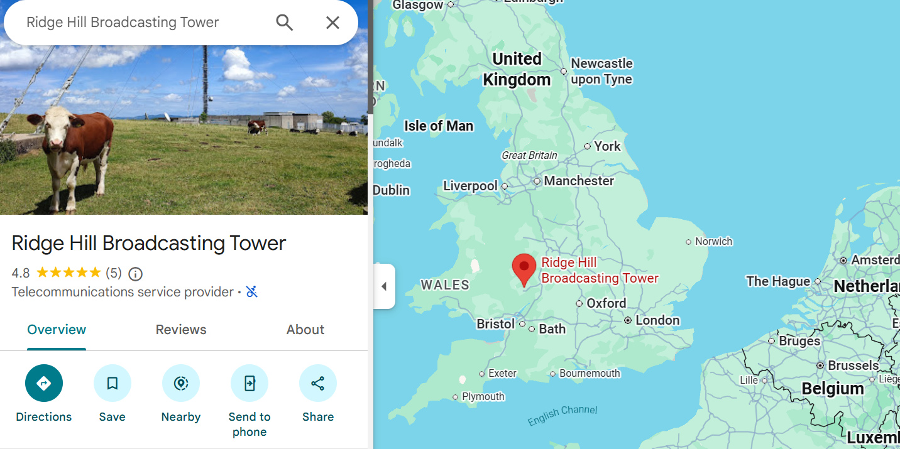
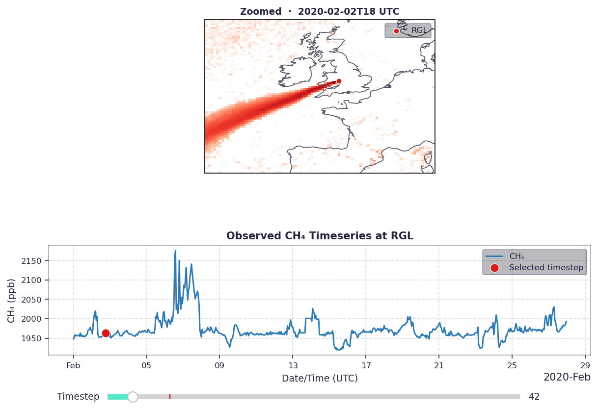
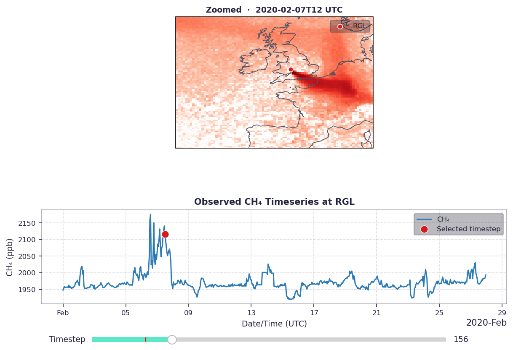
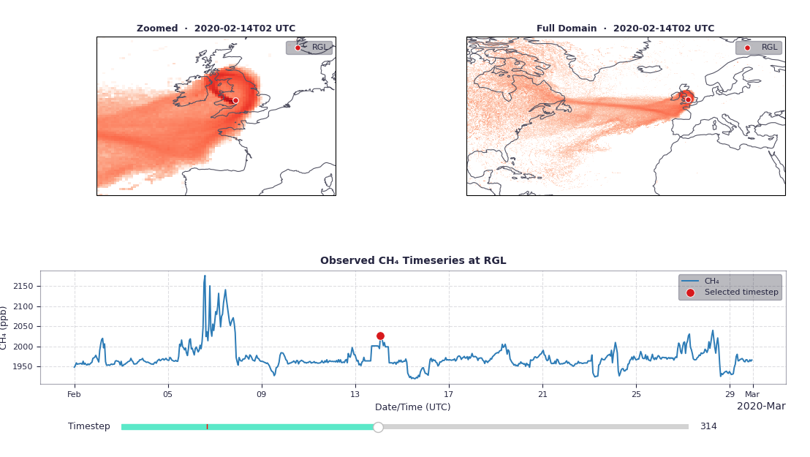
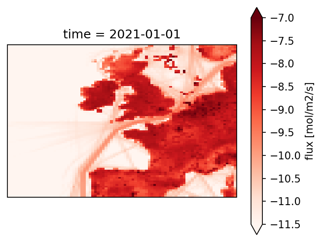

# interactive_GHG_plots

Visualising ACRG data. Replace the data folder with a provided zip.

Please install the environment from the `env.yml` file.

TODO: Write better docstrings!

Follow [the notebook](interactive_plots.py) to plot 
1) the sensitivity footprints, 
2) the timeseries of measurements for a particular site and 
3) maps of estimated man-made emissions.

As an example, I'm using a sensor placed in the Ridge Hill (RGL) transmitting station, near Bristol! 
We will be focusing on methane.

## Example plots:
When the sensitivity plume is over the ocean, the air is unpolluted and the observation is low:

When the sensitivity plume is over Europe, the incoming air is polluted and the observation is high. 
Belgium, Netherlands, Germany and the north of France produce a lot of methane! 

In this case, the sensitivity plume is only over the UK and Ireland, so the air is polluted, but not as much as when it comes from Europe.

## The origin of emissions
This is a map of man-made emissions over UK and part of Europe. Can you identify cities, boat tracks and drilling stations?

